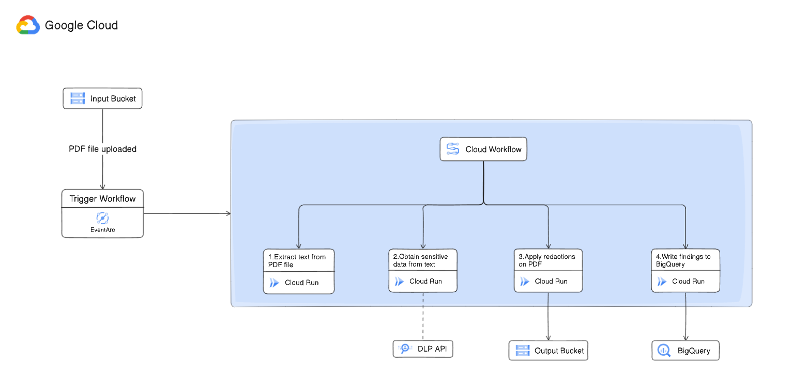

# SensiHidePDF 🕵️‍♂️

An end-to-end solution to hide sensitive information in PDF files, primarily resumes.

## Architecture 🏗️

The application is built natively on **Google Cloud Platform**, Leveraging various services like **Cloud Run**, **Cloud Workflows**, **Cloud Storage: Bucket**, **EventArc**, **Data Loss Prevention API** and **BigQuery**.

The entire application can be provisioned using **Terraform**, making it easy to deploy and manage.

### Here is how it works: 🤔

- Whenever a PDF file is uploaded on the **Cloud Storage Bucket** (input_bucket), an EventArc event is triggered.
- That runs a **Cloud Workflows** which does the following steps in sequence:
  - First cloud run service downloads that PDF file and extracts text from it.
  - Second service gets that text data and it sends it to **Data Loss Prevention API** to detect sensitive information. (For now, it is hardcoded to detect EMAIL_ADDRESS and PHONE_NUMBER)
  - Third service is given the response from DLP API. It then downloads the PDF file and redacts the sensitive information from it. The redacted PDF is then uploaded to another **Cloud Storage Bucket** (output_bucket).
  - Finally, the last service stores the sensitive information in **BigQuery** for further analysis.
- That's it! 🎉

### Services 🛠️

| Service Name | Source Code | Infrastructure |
| --- | --- | --- |
| PDF To Text | [Code](./src/pdf-to-text/) | [Terraform](./terraform/redact-pdf/pdf-to-text.tf) |
| DLP Runner | [Code](./src/dlp-runner/) | [Terraform](./terraform/redact-pdf/dlp-runner.tf) |
| Redactor | [Code](./src/redactor/) | [Terraform](./terraform/redact-pdf/redact-pdf.tf) |
| Findings Writer | [Code](./src/findings-to-bigquery/) | [Terraform](./terraform/redact-pdf/findings-writer.tf) |

Leave a ⭐ if you like this project!

Secret message

There are other solutions out there solving the same problem, namely from GoogleCloudPlatform itself. But there is a huge difference between my implementation and there's. There's implementation converts PDF into images and then gets the images redacted from the DLP API, but the drawback of this approach is that the redacted PDF generated after merging the images is not readable by screen readers, or even searchable making it less accessible at large scale.

I took a different approach, I didn't run DLP API on images. Instead I ran it directly on the text, upon receiving the findings, I did redactions by myself using a python library. This way the PDF remains searchable and ATS friendly.

If you wish you can keep this a secret 🤫

